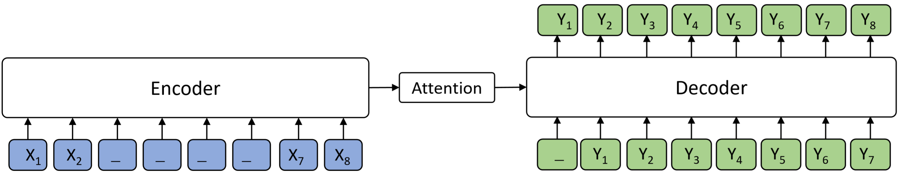

# MASS on fairseq

We implement MASS on [fairseq](https://github.com/pytorch/fairseq), in order to support the pre-training and fine-tuning for large scale supervised tasks, such as neural machine translation, text summarization, grammatical error correction. Unsupervised pre-training usually works better in zero-resource or low-resource downstream tasks. However, there are plenty of supervised data in these tasks, which brings challenges for conventional unsupervised pre-training. Therefore, we design new pre-training loss to support large scale supervised tasks.

We extend the MASS to supervised setting where the supervised sentence pair (X, Y) is leveraged for pre-training. The sentence X is masked and feed into the encoder, and the decoder predicts the whole sentence Y.  


During pre-training, we combine the orignal MASS pre-training loss and the new supervised pre-training loss together. During fine-tuning, we directly use supervised sentence pairs to fine-tune the pre-trained model.  

MASS on fairseq contains the following codes:
* [Neural Machine Translation](#neural-machine-translation)
* [Text Summarization](#text-summarization)
* [Grammatical Error Correction](#grammatical-error-correction)


## Neural Machine Translation 

We provide an example of how to pre-train and fine-tune on WMT English<->Chinese(En<->Zh) translation.

### Data Ready
We first get ready for the monolingual and bilingual sentences for Chinese and English respectively. The data directory looks like:

```
data/
|-- mono/
:   |-- train.en
:   |-- train.zh
:   |-- valid.en
:   |-- valid.zh
:   |-- dict.en.txt
:   |-- dict.zh.txt
|-- para/
    |-- train.en
    |-- train.zh
    |-- valid.en
    |-- valid.zh
    |-- dict.en.txt
    |-- dict.zh.txt
```
The files under `mono` are monolingual data, while under `para` are bilingual data. `dict.en(zh).txt` in different directary should be identical. The dictionary for different language can be different. The following command will generate the binarized data:

```
# Ensure the output directory exists
data_dir=data/
mono_data_dir=$data_dir/mono/
para_data_dir=$data_dir/para/
save_dir=$data_dir/processed/

mkdir -p $data_dir $save_dir $mono_data_dir $para_data_dir


# Generate Monolingual Data
for lg in en zh
do

  python preprocess.py \
  --task cross_lingual_lm \
  --srcdict $mono_data_dir/dict.$lg.txt \
  --only-source \
  --trainpref $mono_data_dir/train \
  --validpref $mono_data_dir/valid \
  --destdir $save_dir \
  --workers 20 \
  --source-lang $lg

  # Since we only have a source language, the output file has a None for the
  # target language. Remove this

  for stage in train valid
  do
    mv $save_dir/$stage.$lg-None.$lg.bin $save_dir/$stage.$lg.bin
    mv $save_dir/$stage.$lg-None.$lg.idx $save_dir/$stage.$lg.idx
  done
done

# Generate Bilingual Data
python preprocess.py \
	--task xmasked_seq2seq \
	--source-lang en --target-lang zh \
	--trainpref $para_data_dir/train --validpref $para_data_dir/valid \
	--destdir $save_dir \
	--srcdict $para_data_dir/dict.en.txt \
	--tgtdict $para_data_dir/dict.zh.txt
```
After that, the files under `processed` are as:
```
data/
|-- processed/
    |-- train.en.bin
    |-- train.en.idx
    |-- train.zh.bin
    |-- train.zh.idx
    |-- train.en-zh.en.bin
    |-- train.en-zh.en.idx
    |-- train.en-zh.zh.bin
    |-- train.en-zh.zh.idx
    |-- valid.en.bin
    |-- valid.en.idx
    |-- valid.zh.bin
    |-- valid.zh.idx
    |-- valid.en-zh.en.bin
    |-- valid.en-zh.en.idx
    |-- valid.en-zh.zh.bin
    |-- valid.en-zh.zh.idx
    |-- dict.en.txt
    |-- dict.zh.txt
```

### Pre-training
We pre-train a transformer model with 10-layer encoder and 6-layer decoder, with 1024 hidden size.
```
seed=1234
max_tokens=2048
update_freq=1
dropout=0.1
attention_heads=16
embed_dim=1024
ffn_embed_dim=4096
encoder_layers=10
decoder_layers=6
save_dir=checkpoints/mass_pretraining


python train.py data/processed/ \
    --task xmasked_seq2seq \
    --source-langs en,zh \
    --target-langs en,zh \
    --langs en,zh \
    --arch xtransformer \
    --mass_steps en-en,zh-zh \
    --memt_steps en-zh,zh-en \
    --save-dir $save_dir \
    --optimizer adam --adam-betas '(0.9, 0.98)' --clip-norm 0.0 \
    --lr-scheduler inverse_sqrt --lr-shrink 0.5 --lr 0.00005 --min-lr 1e-09 \
    --criterion label_smoothed_cross_entropy \
    --lm-bias --lazy-load --seed ${seed} \
    --log-format json \
    --max-tokens ${max_tokens} --update-freq ${update_freq} \
    --encoder-normalize-before  --decoder-normalize-before \
    --dropout ${dropout} --relu-dropout 0.1 --attention-dropout 0.1 \
    --decoder-attention-heads ${attention_heads} --encoder-attention-heads ${attention_heads} \
    --decoder-embed-dim ${embed_dim} --encoder-embed-dim ${embed_dim} \
    --decoder-ffn-embed-dim ${ffn_embed_dim} --encoder-ffn-embed-dim ${ffn_embed_dim} \
    --encoder-layers ${encoder_layers} --decoder-layers ${decoder_layers} \
    --max-update 100000000 --max-epoch 50 \
    --keep-interval-updates 100 --save-interval-updates 3000  --log-interval 50 \
    --share-decoder-input-output-embed \
    --valid-lang-pairs en-zh \
```

### Fine-tuning
After pre-training stage, we fine-tune the model on bilingual sentence pairs:
```
seed=1234
max_tokens=2048
update_freq=1
dropout=0.1
attention_heads=16
embed_dim=1024
ffn_embed_dim=4096
encoder_layers=10
decoder_layers=6
save_dir=checkpoint/enzh_mass_train/
model=enzh_mass_pretrain.pth

mkdir -p $save_dir

python train.py data/processed/ \
    --task xmasked_seq2seq \
    --source-langs zh \
    --target-langs en \
    --langs en,zh \
    --arch xtransformer \
    --mt_steps zh-en \
    --save-dir $save_dir \
    --optimizer adam --adam-betas '(0.9, 0.98)' --clip-norm 0.0 \
    --lr-scheduler inverse_sqrt --lr-shrink 0.5 --lr 0.00005 --min-lr 1e-09 \
    --criterion label_smoothed_cross_entropy \
    --lm-bias --lazy-load --seed ${seed} \
    --log-format json \
    --max-tokens ${max_tokens} --update-freq ${update_freq} \
    --encoder-normalize-before  --decoder-normalize-before \
    --dropout ${dropout} --relu-dropout 0.1 --attention-dropout 0.1 \
    --decoder-attention-heads ${attention_heads} --encoder-attention-heads ${attention_heads} \
    --decoder-embed-dim ${embed_dim} --encoder-embed-dim ${embed_dim} \
    --decoder-ffn-embed-dim ${ffn_embed_dim} --encoder-ffn-embed-dim ${ffn_embed_dim} \
    --encoder-layers ${encoder_layers} --decoder-layers ${decoder_layers} \
    --max-update 10 --max-epoch 50 \
    --keep-interval-updates 100 --save-interval-updates 3000  --log-interval 50 \
    --share-decoder-input-output-embed \
    --valid-lang-pairs zh-en \
    --reload-checkpoint $model
```


## Text Summarization
To be updated soon

## Grammatical Error Correction
To be updated soon

## Paper
Paper for supervised pre-training will be available soon
