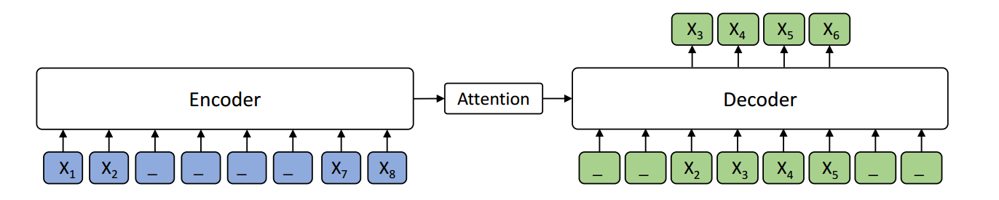

# MASS
<!---
[](https://paperswithcode.com/sota/unsupervised-machine-translation-on-wmt2014-2?p=mass-masked-sequence-to-sequence-pre-training)
[](https://paperswithcode.com/sota/unsupervised-machine-translation-on-wmt2014-1?p=mass-masked-sequence-to-sequence-pre-training)
[](https://paperswithcode.com/sota/unsupervised-machine-translation-on-wmt2016?p=mass-masked-sequence-to-sequence-pre-training)
[](https://paperswithcode.com/sota/unsupervised-machine-translation-on-wmt2016-1?p=mass-masked-sequence-to-sequence-pre-training)
[](https://paperswithcode.com/sota/unsupervised-machine-translation-on-wmt2016-3?p=mass-masked-sequence-to-sequence-pre-training)
[](https://paperswithcode.com/sota/unsupervised-machine-translation-on-wmt2016-5?p=mass-masked-sequence-to-sequence-pre-training)
[](https://paperswithcode.com/sota/machine-translation-on-wmt2017-chinese?p=mass-masked-sequence-to-sequence-pre-training)                                                             
[](https://paperswithcode.com/sota/machine-translation-on-wmt2016-romanian?p=mass-masked-sequence-to-sequence-pre-training)                       
[](https://paperswithcode.com/sota/machine-translation-on-wmt2019-english?p=mass-masked-sequence-to-sequence-pre-training)
-->


[MASS: Masked Sequence to Sequence Pre-training for Language Generation](https://arxiv.org/pdf/1905.02450.pdf), by Kaitao Song, [Xu Tan](https://www.microsoft.com/en-us/research/people/xuta/), [Tao Qin](https://www.microsoft.com/en-us/research/people/taoqin/), Jianfeng Lu, [Tie-Yan Liu](https://www.microsoft.com/en-us/research/people/tyliu/), is a novel pre-training method for sequence to sequence based language generation tasks. It randomly masks a sentence fragment in the encoder, and then predicts it in the decoder.



MASS can be applied on cross-lingual tasks such as neural machine translation (NMT), and monolingual tasks such as text summarization. The current codebase supports unsupervised NMT (implemented based on XLM), supervised NMT, text summarization and conversational response generation, which are all based on Fairseq. We will release our implementation for other sequence to sequence generation tasks in the future.

* [Unsupervised Neural Machine Translation](#unsupervised-nmt)
* [Supervised Neural Machine Translation](#supervised-nmt)
* [Text Summarization](#text-summarization)


### What is New!
We release [MPNet](https://arxiv.org/pdf/2004.09297.pdf), a new pre-trained method for language understanding. GitHub: https://github.com/microsoft/MPNet


## Unsupervised NMT

Unsupervised Neural Machine Translation just uses monolingual data to train the models. During MASS pre-training, the source and target languages are pre-trained in one model, with the corresponding langauge embeddings to differentiate the langauges. During MASS fine-tuning, back-translation is used to train the unsupervised models. Code is under [MASS-unsupNMT](MASS-unsupNMT). We provide pre-trained and fine-tuned models:

| Languages | Pre-trained Model | Fine-tuned Model | BPE codes | Vocabulary |
|-----------|:-----------------:|:----------------:| ---------:| ----------:|
| EN - FR   | [MODEL](https://modelrelease.blob.core.windows.net/mass/mass_enfr_1024.pth)    |   [MODEL](https://modelrelease.blob.core.windows.net/mass/mass_ft_enfr_1024.pth)   | [BPE codes](https://dl.fbaipublicfiles.com/XLM/codes_enfr) | [Vocabulary](https://dl.fbaipublicfiles.com/XLM/vocab_enfr) |
| EN - DE   | [MODEL](https://modelrelease.blob.core.windows.net/mass/mass_ende_1024.pth) | [MODEL](https://modelrelease.blob.core.windows.net/mass/mass_ft_ende_1024.pth) | [BPE codes](https://dl.fbaipublicfiles.com/XLM/codes_ende) | [Vocabulary](https://dl.fbaipublicfiles.com/XLM/vocab_ende) |
| En - RO   | [MODEL](https://modelrelease.blob.core.windows.net/mass/mass_enro_1024.pth) | [MODEL](https://modelrelease.blob.core.windows.net/mass/mass_ft_enro_1024.pth) | [BPE_codes](https://dl.fbaipublicfiles.com/XLM/codes_enro) | [Vocabulary](https://dl.fbaipublicfiles.com/XLM/vocab_enro) |

We are also preparing larger models on more language pairs, and will release them in the future.

### Dependencies
Currently we implement MASS for unsupervised NMT based on the codebase of [XLM](https://github.com/facebookresearch/XLM). The depencies are as follows:
- Python 3
- NumPy
- PyTorch (version 0.4 and 1.0)
- fastBPE (for BPE codes)
- Moses (for tokenization)
- Apex (for fp16 training)

### Data Ready

We use the same BPE codes and vocabulary with XLM. Here we take English-French as an example.

```
cd MASS

wget https://dl.fbaipublicfiles.com/XLM/codes_enfr
wget https://dl.fbaipublicfiles.com/XLM/vocab_enfr

./get-data-nmt.sh --src en --tgt fr --reload_codes codes_enfr --reload_vocab vocab_enfr
```

### Pre-training:
```
python train.py                                      \
--exp_name unsupMT_enfr                              \
--data_path ./data/processed/en-fr/                  \
--lgs 'en-fr'                                        \
--mass_steps 'en,fr'                                 \
--encoder_only false                                 \
--emb_dim 1024                                       \
--n_layers 6                                         \
--n_heads 8                                          \
--dropout 0.1                                        \
--attention_dropout 0.1                              \
--gelu_activation true                               \
--tokens_per_batch 3000                              \
--optimizer adam_inverse_sqrt,beta1=0.9,beta2=0.98,lr=0.0001 \
--epoch_size 200000                                  \
--max_epoch 100                                      \
--eval_bleu true                                     \
--word_mass 0.5                                      \
--min_len 5                                          \
```


During the pre-training prcess, even without any back-translation, you can observe the model can achieve some intial BLEU scores:
```
epoch -> 4
valid_fr-en_mt_bleu -> 10.55
valid_en-fr_mt_bleu ->  7.81
test_fr-en_mt_bleu  -> 11.72
test_en-fr_mt_bleu  ->  8.80
```
#### Distributed Training

To use *multiple GPUs* e.g. 3 GPUs **on same node**
```
export NGPU=3; CUDA_VISIBLE_DEVICES=0,1,2 python -m torch.distributed.launch --nproc_per_node=$NGPU train.py [...args]
```
To use *multiple GPUS* across **many nodes**, use Slurm to request multi-node job and launch the above command. 
The code automatically detects the SLURM_* environment vars to distribute the training.


### Fine-tuning 
After pre-training, we use back-translation to fine-tune the pre-trained model on unsupervised machine translation:
```
MODEL=mass_enfr_1024.pth

python train.py \
  --exp_name unsupMT_enfr                              \
  --data_path ./data/processed/en-fr/                  \
  --lgs 'en-fr'                                        \
  --bt_steps 'en-fr-en,fr-en-fr'                       \
  --encoder_only false                                 \
  --emb_dim 1024                                       \
  --n_layers 6                                         \
  --n_heads 8                                          \
  --dropout 0.1                                        \
  --attention_dropout 0.1                              \
  --gelu_activation true                               \
  --tokens_per_batch 2000                              \
  --batch_size 32	                                     \
  --bptt 256                                           \
  --optimizer adam_inverse_sqrt,beta1=0.9,beta2=0.98,lr=0.0001 \
  --epoch_size 200000                                  \
  --max_epoch 30                                       \
  --eval_bleu true                                     \
  --reload_model "$MODEL,$MODEL"                       \
```

We also provide a demo to use MASS pre-trained model on the WMT16 en-ro bilingual dataset. We provide pre-trained and fine-tuned models:

| Model | Ro-En BLEU (with BT) |
|:---------:|:----:|
| Baseline | 34.0 |
| XLM | 38.5 |
| [MASS](https://modelrelease.blob.core.windows.net/mass/mass_mt_enro_1024.pth) | 39.1 |


Download dataset by the below command:
```
wget https://dl.fbaipublicfiles.com/XLM/codes_enro
wget https://dl.fbaipublicfiles.com/XLM/vocab_enro

./get-data-bilingual-enro-nmt.sh --src en --tgt ro --reload_codes codes_enro --reload_vocab vocab_enro
```

After download the mass pre-trained model from the above link. And use the following command to fine tune:
```
MODEL=mass_enro_1024.pth

python train.py \
	--exp_name unsupMT_enro                              \
	--data_path ./data/processed/en-ro                   \
	--lgs 'en-ro'                                        \
	--bt_steps 'en-ro-en,ro-en-ro'                       \
	--encoder_only false                                 \
	--mt_steps 'en-ro,ro-en'                             \
	--emb_dim 1024                                       \
	--n_layers 6                                         \
	--n_heads 8                                          \
	--dropout 0.1                                        \
	--attention_dropout 0.1                              \
	--gelu_activation true                               \
	--tokens_per_batch 2000                              \
	--batch_size 32                                      \
	--bptt 256                                           \
	--optimizer adam_inverse_sqrt,beta1=0.9,beta2=0.98,lr=0.0001 \
	--epoch_size 200000                                  \
	--max_epoch 50                                       \
	--eval_bleu true                                     \
	--reload_model "$MODEL,$MODEL"
```

## Supervised NMT

We also implement MASS on [fairseq](https://github.com/pytorch/fairseq), in order to support the pre-training and fine-tuning for large scale supervised tasks, such as neural machine translation, text summarization. Unsupervised pre-training usually works better in zero-resource or low-resource downstream tasks. However, in large scale supervised NMT, there are plenty of bilingual data, which brings challenges for conventional unsupervised pre-training. Therefore, we design new pre-training loss to support large scale supervised NMT. The code is under [MASS-supNMT](MASS-supNMT).

We extend the MASS to supervised setting where the supervised sentence pair (X, Y) is leveraged for pre-training. The sentence X is masked and feed into the encoder, and the decoder predicts the whole sentence Y. Some discret tokens in the decoder input are also masked, to encourage the decoder to extract more informaiton from the encoder side.   


During pre-training, we combine the orignal MASS pre-training loss and the new supervised pre-training loss together. During fine-tuning, we directly use supervised sentence pairs to fine-tune the pre-trained model. Except for NMT, this pre-trainig paradigm can be also applied on other superviseed sequence to sequence tasks.

We release the pre-trained model and example codes of how to pre-train and fine-tune on WMT Chinese<->English (Zh<->En) translation.:

| Languages | Pre-trained Model | BPE codes | English-Dict | Chinese-Dict |
|:-----------:|:-----------------:| :---------:| :------------:| :------------:|
|Zh - En      | [MODEL](https://modelrelease.blob.core.windows.net/mass/zhen_mass_pre-training.pt) | [CODE](https://modelrelease.blob.core.windows.net/mass/bpecode.zip) | [VOCAB](https://modelrelease.blob.core.windows.net/mass/dict.en.txt) | [VOCAB](https://modelrelease.blob.core.windows.net/mass/dict.zh.txt)


### Prerequisites
After download the repository, you need to install `fairseq` by `pip`:
```
pip install fairseq==0.7.1
```

### Data Ready
We first prepare the monolingual and bilingual sentences for Chinese and English respectively. The data directory looks like:

```
- data/
  ├─ mono/
  |  ├─ train.en
  |  ├─ train.zh
  |  ├─ valid.en
  |  ├─ valid.zh
  |  ├─ dict.en.txt
  |  └─ dict.zh.txt
  └─ para/
     ├─ train.en
     ├─ train.zh
     ├─ valid.en
     ├─ valid.zh
     ├─ dict.en.txt
     └─ dict.zh.txt
```
The files under `mono` are monolingual data, while under `para` are bilingual data. `dict.en(zh).txt` in different directory should be identical. The dictionary for different language can be different. Running the following command can generate the binarized data:

```
# Ensure the output directory exists
data_dir=data/
mono_data_dir=$data_dir/mono/
para_data_dir=$data_dir/para/
save_dir=$data_dir/processed/

# set this relative path of MASS in your server
user_dir=mass

mkdir -p $data_dir $save_dir $mono_data_dir $para_data_dir


# Generate Monolingual Data
for lg in en zh
do

  fairseq-preprocess \
  --task cross_lingual_lm \
  --srcdict $mono_data_dir/dict.$lg.txt \
  --only-source \
  --trainpref $mono_data_dir/train --validpref $mono_data_dir/valid \
  --destdir $save_dir \
  --workers 20 \
  --source-lang $lg

  # Since we only have a source language, the output file has a None for the
  # target language. Remove this

  for stage in train valid
  do
    mv $save_dir/$stage.$lg-None.$lg.bin $save_dir/$stage.$lg.bin
    mv $save_dir/$stage.$lg-None.$lg.idx $save_dir/$stage.$lg.idx
  done
done

# Generate Bilingual Data
fairseq-preprocess \
  --user-dir $mass_dir \
  --task xmasked_seq2seq \
  --source-lang en --target-lang zh \
  --trainpref $para_data_dir/train --validpref $para_data_dir/valid \
  --destdir $save_dir \
  --srcdict $para_data_dir/dict.en.txt \
  --tgtdict $para_data_dir/dict.zh.txt
```


### Pre-training
We provide a simple demo code to demonstrate how to deploy mass pre-training.
```
save_dir=checkpoints/mass/pre-training/
user_dir=mass
data_dir=data/processed/

mkdir -p $save_dir

fairseq-train $data_dir \
    --user-dir $user_dir \
    --save-dir $save_dir \
    --task xmasked_seq2seq \
    --source-langs en,zh \
    --target-langs en,zh \
    --langs en,zh \
    --arch xtransformer \
    --mass_steps en-en,zh-zh \
    --memt_steps en-zh,zh-en \
    --optimizer adam --adam-betas '(0.9, 0.98)' --clip-norm 0.0 \
    --lr-scheduler inverse_sqrt --lr 0.00005 --min-lr 1e-09 \
    --criterion label_smoothed_cross_entropy \
    --max-tokens 4096 \
    --dropout 0.1 --relu-dropout 0.1 --attention-dropout 0.1 \
    --max-update 100000 \
    --share-decoder-input-output-embed \
    --valid-lang-pairs en-zh \
```
We also provide a pre-training [script](MASS-supNMT/run_mass_enzh.sh) which is used for our released model.

### Fine-tuning
After pre-training stage, we fine-tune the model on bilingual sentence pairs:
```
data_dir=data/processed
save_dir=checkpoints/mass/fine_tune/
user_dir=mass
model=checkpoint/mass/pre-training/checkpoint_last.pt # The path of pre-trained model

mkdir -p $save_dir

fairseq-train $data_dir \
    --user-dir $user_dir \
    --task xmasked_seq2seq \
    --source-langs zh --target-langs en \
    --langs en,zh \
    --arch xtransformer \
    --mt_steps zh-en \
    --save-dir $save_dir \
    --optimizer adam --adam-betas '(0.9, 0.98)' --clip-norm 0.0 \
    --lr-scheduler inverse_sqrt --lr-shrink 0.5 --lr 0.00005 --min-lr 1e-09 \
    --criterion label_smoothed_cross_entropy \
    --max-tokens 4096 \
    --max-update 100000 --max-epoch 50 \
    --dropout 0.1 --relu-dropout 0.1 --attention-dropout 0.1 \
    --share-decoder-input-output-embed \
    --valid-lang-pairs zh-en \
    --reload_checkpoint $model
```
We also provide a fine-tuning [script](MASS-supNMT/ft_mass_enzh.sh) which is used for our pre-trained model.

### Inference
After the fine-tuning stage, you can generate translation results by using the below [script](MASS-supNMT/translate.sh):
```
model=checkpoints/mass/fine_tune/checkpoint_best.pt
data_dir=data/processed
user_dir=mass

fairseq-generate $data_dir \
    --user-dir $user_dir \
    -s zh -t en \
    --langs en,zh \
    --source-langs zh --target-langs en \
    --mt_steps zh-en \
    --gen-subset valid \
    --task xmasked_seq2seq \
    --path $model \
    --beam 5 --remove-bpe 
```

## Text Summarization

MASS for text summarization is also implemented on [fairseq](https://github.com/pytorch/fairseq). The code is under [MASS-summarization](MASS-summarization).


### Dependency
```
pip install torch==1.0.0 
pip install fairseq==0.8.0
```

### MODEL
MASS uses default Transformer structure. We denote L, H, A as the number of layers, the hidden size and the number of attention heads. 

| Model | Encoder | Decoder | Download |
| :------| :-----|:-----|:-----|
| MASS-base-uncased | 6L-768H-12A | 6L-768H-12A | [MODEL](https://modelrelease.blob.core.windows.net/mass/mass-base-uncased.tar.gz) | 
| MASS-middle-uncased | 6L-1024H-16A | 6L-1024H-16A | [MODEL](https://modelrelease.blob.core.windows.net/mass/mass-middle-uncased.tar.gz) |

### Results on Abstractive Summarization (12/03/2019)

| Dataset | RG-1 | RG-2 | RG-L |
| ------| ---- | ---- | ---- |
| CNN/Daily Mail | 43.05 | 20.02 | 40.08 |  
| Gigaword | 38.93 | 20.20 | 36.20 |
| XSum | 39.75 | 17.24 | 31.95 |

Evaluated by [files2rouge](https://github.com/pltrdy/files2rouge). 

### Pipeline for Pre-Training
#### Download data
Our model is trained on Wikipekia + BookCorpus. Here we use wikitext-103 to demonstrate how to process data.
```
wget https://s3.amazonaws.com/research.metamind.io/wikitext/wikitext-103-raw-v1.zip
unzip wikitext-103-raw-v1.zip
```

#### Tokenize corpus
We use wordpiece vocabuary (from bert) to tokenize the original text data directly. We provide a [script](MASS-summarization/encode.py) to deal with data. You need to `pip install pytorch_transformers` first to generate tokenized data. 
```
mkdir -p mono
for SPLIT in train valid test; do 
    python encode.py \
        --inputs wikitext-103-raw/wiki.${SPLIT}.raw \
        --outputs mono/${SPLIT}.txt \
        --workers 60; \
done 
```

#### Binarized data
```
wget -c https://modelrelease.blob.core.windows.net/mass/mass-base-uncased.tar.gz
tar -zxvf mass-base-uncased.tar.gz
# Move dict.txt from tar file to the data directory 

fairseq-preprocess \
    --user-dir mass --only-source \
    --trainpref mono/train.txt --validpref mono/valid.txt --testpref mono/test.txt \
    --destdir processed --srcdict dict.txt --workers 60
```

#### Pre-training
```
TOKENS_PER_SAMPLE=512
WARMUP_UPDATES=10000
PEAK_LR=0.0005
TOTAL_UPDATES=125000
MAX_SENTENCES=8
UPDATE_FREQ=16

fairseq-train processed \
    --user-dir mass --task masked_s2s --arch transformer_mass_base \
    --sample-break-mode none \
    --tokens-per-sample $TOKENS_PER_SAMPLE \
    --criterion masked_lm \
    --optimizer adam --adam-betas '(0.9, 0.98)' --adam-eps 1e-6 --clip-norm 0.0 \
    --lr-scheduler polynomial_decay --lr $PEAK_LR --warmup-updates $WARMUP_UPDATES --total-num-update $TOTAL_UPDATES \
    --dropout 0.1 --attention-dropout 0.1 --weight-decay 0.01 \
    --max-sentences $MAX_SENTENCES --update-freq $UPDATE_FREQ \
    --ddp-backend=no_c10d \
```
### Pipeline for Fine-tuning (CNN / Daily Mail)

#### Data 
Download, tokenize and truncate data from this [link](https://github.com/abisee/cnn-dailymail), and use the above [tokenization](#tokenize-corpus) to generate wordpiece-level data. Rename the shuffix `article` and `title` as `src` and `tgt`. Assume the tokenized data is under `cnndm/para`
```
fairseq-preprocess \
    --user-dir mass --task masked_s2s \
    --source-lang src --target-lang tgt \
    --trainpref cnndm/para/train --validpref cnndm/para/valid --testpref cnndm/para/test \
    --destdir cnndm/processed --srcdict dict.txt --tgtdict dict.txt \
    --workers 20
```
`dict.txt` is included in `mass-base-uncased.tar.gz`. A copy of binarized data can be obtained from [here](https://modelrelease.blob.core.windows.net/mass/cnndm.tar.gz).


#### Running
```
fairseq-train cnndm/processed/ \
    --user-dir mass --task translation_mass --arch transformer_mass_base \
    --optimizer adam --adam-betas '(0.9, 0.98)' --clip-norm 0.0 \
    --lr 0.0005 --min-lr 1e-09 \
    --lr-scheduler inverse_sqrt --warmup-init-lr 1e-07 --warmup-updates 4000 \
    --weight-decay 0.0 \
    --criterion label_smoothed_cross_entropy --label-smoothing 0.1 \
    --update-freq 8 --max-tokens 4096 \
    --ddp-backend=no_c10d --max-epoch 25 \
    --max-source-positions 512 --max-target-positions 512 \
    --skip-invalid-size-inputs-valid-test \
    --load-from-pretrained-model mass-base-uncased.pt \
```
`lr=0.0005` is not the optimal choice for any task. It is tuned on the dev set (among 1e-4, 2e-4, 5e-4). 
#### Inference
```
MODEL=checkpoints/checkpoint_best.pt
fairseq-generate $DATADIR --path $MODEL \
    --user-dir mass --task translation_mass \
    --batch-size 64 --beam 5 --min-len 50 --no-repeat-ngram-size 3 \
    --lenpen 1.0 \
```
`min-len` is sensitive for different tasks, `lenpen` needs to be tuned on the dev set.

<!---
## Training Details 

`MASS-base-uncased` uses 32x NVIDIA 32GB V100 GPUs and trains on (Wikipekia + BookCorpus, 16GB) for 20 epochs (float32), batch size is simulated as 4096.


### Other questions
> 1. Q: When I run this program in multi-gpus or multi-nodes, the program reports errors like `ModuleNotFouldError: No module named 'mass'`.   
  A: This seems a bug in python `multiprocessing/spawn.py`, a direct solution is to move these files into each relative folder under fairseq. Do not forget to modify the import path in the code.
-->


## Reference

If you find MASS useful in your work, you can cite the paper as below:

    @inproceedings{song2019mass,
        title={MASS: Masked Sequence to Sequence Pre-training for Language Generation},
        author={Song, Kaitao and Tan, Xu and Qin, Tao and Lu, Jianfeng and Liu, Tie-Yan},
        booktitle={International Conference on Machine Learning},
        pages={5926--5936},
        year={2019}
    }
    
## Related Works

* [MPNet: Masked and Permuted Pre-training for Language Understanding](https://arxiv.org/pdf/2004.09297.pdf), by Kaitao Song, Xu Tan, Tao Qin, Jianfeng Lu, Tie-Yan Liu. GitHub: https://github.com/microsoft/MPNet

